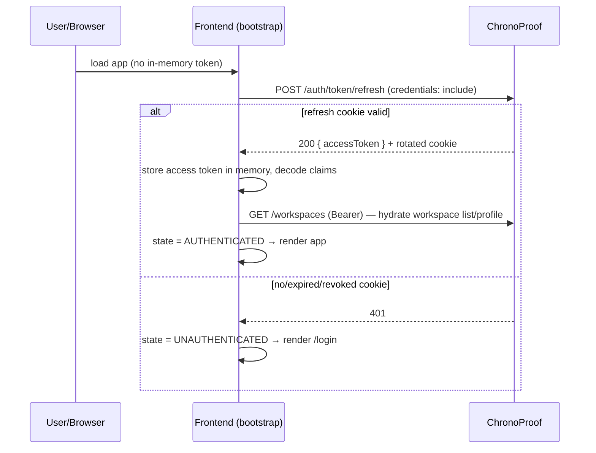
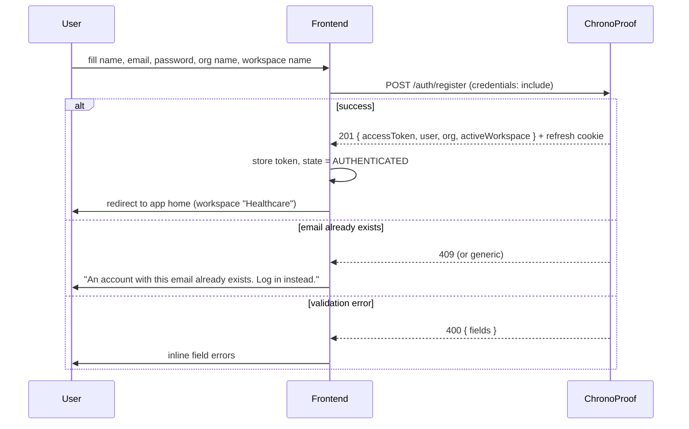
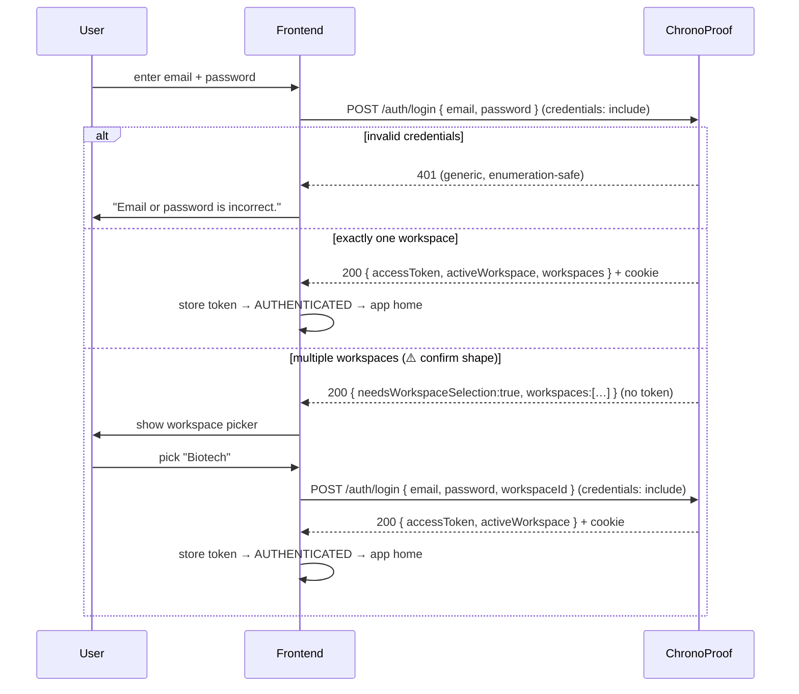
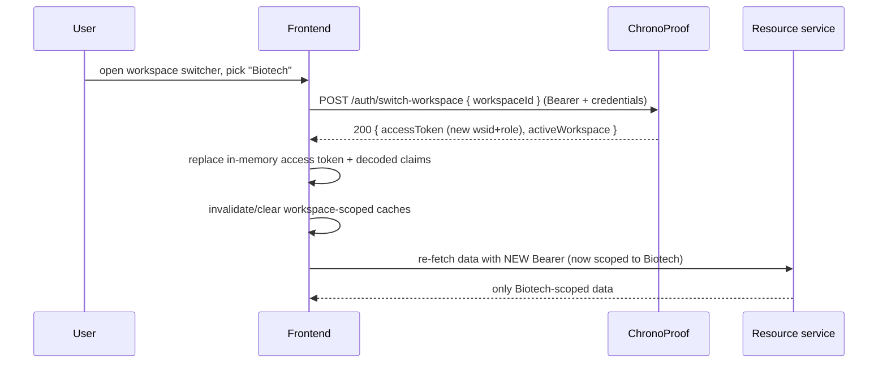
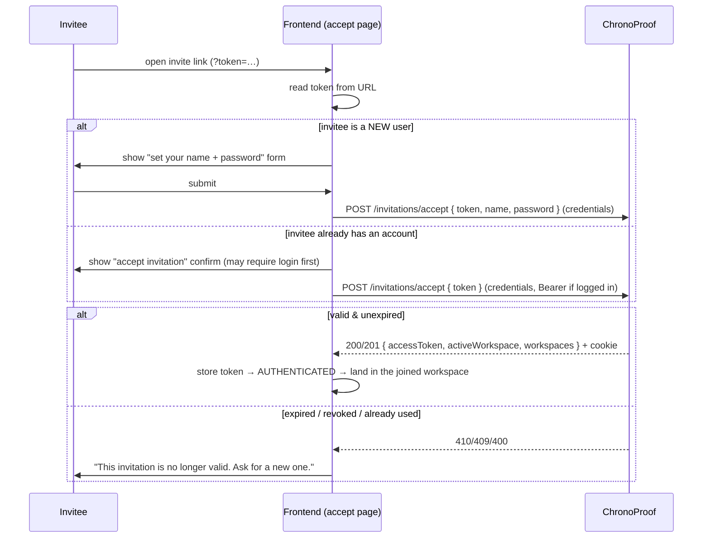
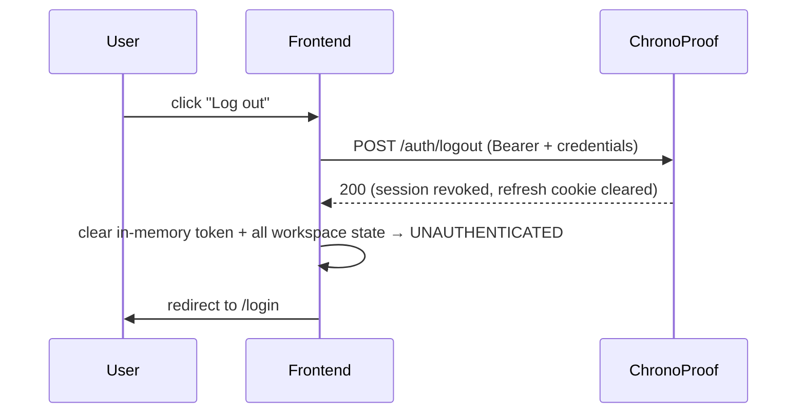
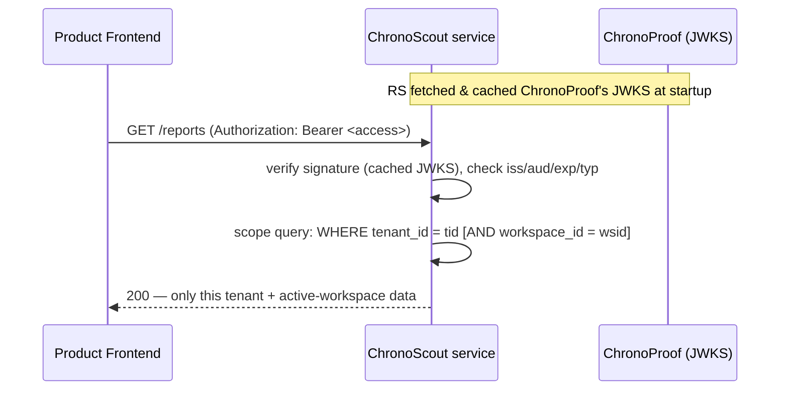
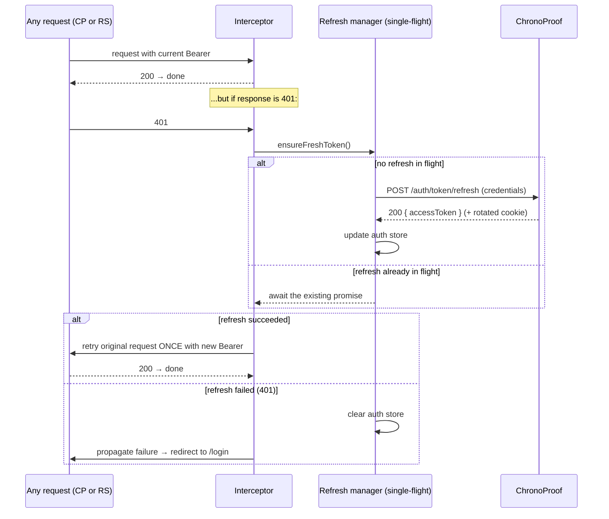

# ChronoProof — Frontend Flow & Integration Guide

- **Date:** 2026-06-30
- **Audience:** Frontend developer(s) starting the client app(s) — the ChronoProof console and the five product UIs (ChronoScout, ChronoTruth, ChronoPulse, ChronoSee, ChronoCurve).
- **Purpose:** Give the frontend a complete, framework-agnostic picture of how the UI drives ChronoProof's identity API and consumes the resource services — so frontend and backend stay in sync. **No frontend stack is prescribed.** Everything here is expressed as flows, responsibilities, sequences, and contracts that any SPA (React, Vue, Svelte, Angular, …) can implement.
- **Source of truth:** This doc is derived from the approved design spec ([2026-06-29-chronoproof-multitenant-auth-design.md](superpowers/specs/2026-06-29-chronoproof-multitenant-auth-design.md)) and the foundation plan ([2026-06-29-chronoproof-foundation-token-core.md](superpowers/plans/2026-06-29-chronoproof-foundation-token-core.md)). Where the backend has **not yet implemented** an endpoint, the request/response shape is marked **⚠️ CONTRACT — confirm with backend**. Treat those as proposals to lock jointly, not as finished APIs.

> **Build status at time of writing:** Only the cryptographic + persistence foundation exists (JWKS endpoint, token core, DB schema). The auth/org/workspace/invite **endpoints** themselves (`/auth/register`, `/auth/login`, …) are planned but not yet built. So: the **claim shape and JWKS are final**; **HTTP request/response bodies are proposed** and must be agreed as those endpoints land.

---

## Table of contents

1. [Mental model the frontend must hold](#1-mental-model-the-frontend-must-hold)
2. [The token lifecycle (the most important section)](#2-the-token-lifecycle-the-most-important-section)
3. [Client building blocks (framework-agnostic responsibilities)](#3-client-building-blocks-framework-agnostic-responsibilities)
4. [Auth state machine & route guards](#4-auth-state-machine--route-guards)
5. [API surface the frontend calls](#5-api-surface-the-frontend-calls)
6. [Screen-by-screen flows](#6-screen-by-screen-flows)
   - 6.1 [App bootstrap (cold start / hard refresh)](#61-app-bootstrap-cold-start--hard-refresh)
   - 6.2 [Registration — new firm](#62-registration--new-firm)
   - 6.3 [Login — single vs. multiple workspaces](#63-login--single-vs-multiple-workspaces)
   - 6.4 [Switching the active workspace](#64-switching-the-active-workspace)
   - 6.5 [Invitations — invite & accept](#65-invitations--invite--accept)
   - 6.6 [Members & workspace management](#66-members--workspace-management)
   - 6.7 [Sessions / device management](#67-sessions--device-management)
   - 6.8 [Logout & logout-all](#68-logout--logout-all)
7. [Calling the resource services (ChronoScout et al.)](#7-calling-the-resource-services-chronoscout-et-al)
8. [Silent refresh & 401 retry (single-flight)](#8-silent-refresh--401-retry-single-flight)
9. [Error handling & status codes](#9-error-handling--status-codes)
10. [Security do's and don'ts (frontend)](#10-security-dos-and-donts-frontend)
11. [Edge cases & gotchas](#11-edge-cases--gotchas)
12. [Open contract questions for the backend](#12-open-contract-questions-for-the-backend)

---

## 1. Mental model the frontend must hold

Before any screens, internalize the domain. Getting these wrong leads to data-isolation bugs in the UI.

| Concept | What it means for the UI |
|---|---|
| **Organization = Tenant** | A VC firm (e.g. "Sequoia Capital"). A user belongs to **exactly one** org. There is no org switcher. |
| **Workspace** | A team area inside the org (e.g. "Healthcare"). One org has **many** workspaces. A user can be a member of **several** workspaces in their org. |
| **Active workspace** | At any moment, the session is bound to **one** active workspace. This is baked into the access token (`wsid` claim). **All resource-service data the user sees is scoped to this active workspace.** Changing it requires a new token (see [§6.4](#64-switching-the-active-workspace)). |
| **Healthcare companies (Pfizer, Moderna…)** | **Shared reference data, NOT tenants.** They are not orgs and not workspaces. Don't model them as accounts. |
| **Org role** (`orole`: `owner` / `admin` / `member`) | Governs org-wide powers: create workspaces, invite people, manage the org. Drives which admin UI a user sees. |
| **Workspace role** (`role`: `owner` / `member`) | The user's role **in the active workspace**. Drives per-workspace permissions (e.g. manage members). |

**Identity is centralized.** ChronoProof is the single sign-on provider. The five product UIs do **not** have their own login — they consume tokens minted by ChronoProof.

**Two role claims, two scopes.** `orole` is org-wide; `role` is for the *active* workspace and changes when the user switches workspace. Gate UI on both.

---

## 2. The token lifecycle (the most important section)

ChronoProof issues **two** tokens with very different handling rules. **The frontend must treat them differently.**

### 2.1 Access token

- **What:** A signed JWT (RS256), ~**15 minutes** TTL, carrying the user's identity + active workspace + roles (see claim shape below).
- **Where it lives on the client:** **In memory only** (a JS variable / in-memory store / state atom). **Never** `localStorage`, **never** `sessionStorage`, **never** a non-httpOnly cookie. Memory-only storage means an XSS attacker cannot trivially exfiltrate a long-lived credential.
- **How it's used:** Sent as `Authorization: Bearer <access>` on **every** call to ChronoProof's protected endpoints **and** to the resource services.
- **Consequence of memory-only:** On a hard page refresh or new tab, the in-memory access token is **gone**. The app must **silently re-mint** it on bootstrap using the refresh cookie ([§6.1](#61-app-bootstrap-cold-start--hard-refresh)). This is expected and correct — design the bootstrap around it.

**Access-token claim shape (final — from the spec):**
```jsonc
{
  "iss": "https://auth.chronoproof.com",
  "aud": "chrono-services",
  "sub": "<user_id>",
  "tid": "<org_id = tenant_id>",
  "wsid": "<active_workspace_id>",
  "role": "owner|member",          // role in the ACTIVE workspace
  "orole": "owner|admin|member",   // org-level role
  "sid": "<session_id>",
  "typ": "access",
  "jti": "<uuid>",
  "iat": 0,
  "exp": 0
}
```

> The frontend **may** decode the JWT payload (base64url of the middle segment) purely to read `wsid`, `role`, `orole`, `exp` for UI decisions — e.g. to show the right admin controls or to know when to refresh. **Never trust client-side decoding for security**; it's a UX convenience only. The backend and resource services re-verify the signature on every request. Do **not** install a verification library on the client; you don't have (and don't want) the signing key, and the public-key check belongs server-side.

### 2.2 Refresh token

- **What:** An **opaque** high-entropy random string (NOT a JWT), ~**30 days** TTL. Only its hash is stored server-side, tied to one session/device row.
- **Where it lives on the client:** For browser clients, delivered as an **`httpOnly`, `Secure`, `SameSite` cookie** by ChronoProof. **JavaScript cannot read it — and that's the point.** You never see it, never store it, never attach it manually.
- **How it's used:** The browser sends it **automatically** on requests to the ChronoProof origin **only if** the request is made with credentials included (`fetch(..., { credentials: "include" })` / `withCredentials: true`). The refresh endpoint reads the cookie; the frontend sends **no token in the body**.
- **Rotation + reuse detection:** Every refresh **rotates** the token (old one invalidated). If an old/already-used refresh token is presented, the backend **revokes the entire session family** → the next refresh fails → the user is forced to log in again. The frontend's only job is to handle the "refresh failed" path gracefully (redirect to login).

### 2.3 Cardinal rules (put these on a sticky note)

1. **Access token → memory. Refresh token → httpOnly cookie you never touch.**
2. **Every request to ChronoProof uses `credentials: "include"`** so the refresh cookie flows. (Resource-service calls do **not** need credentials — they use only the Bearer header.)
3. **On 401 from any API:** try **one** silent refresh, then retry the original request once. If refresh fails → log out + redirect to login. ([§8](#8-silent-refresh--401-retry-single-flight))
4. **Switching workspace mints a new access token** with a new `wsid` — replace the in-memory token and re-fetch workspace-scoped data.
5. **Never** persist tokens to disk/storage. The refresh cookie is the only thing that survives a reload, and the browser owns it.

---

## 3. Client building blocks (framework-agnostic responsibilities)

Regardless of framework, the app needs these **five responsibilities**. Map them onto your stack's idioms (a React context + hook, a Pinia store, a Svelte store, an Angular service — all fine).

| # | Responsibility | What it does |
|---|---|---|
| **A** | **Auth store** | Holds in-memory: `accessToken`, decoded `{ userId, orgId, workspaceId, role, orole, sessionId, exp }`, the current `user` profile, and the list of `workspaces` the user can access. Single source of truth for "am I logged in / what's my active workspace". |
| **B** | **ChronoProof API client** | Wraps fetch/axios for the **auth origin**. Always `credentials: "include"`. Injects `Authorization: Bearer <access>` when present. Centralizes base URL. |
| **C** | **Resource API client(s)** | Wraps calls to each product service origin. Injects `Authorization: Bearer <access>`. **No credentials/cookies.** May be one client per service or one with a configurable base URL. |
| **D** | **Refresh manager (single-flight)** | Performs `POST /auth/token/refresh`. Guarantees **at most one** refresh in flight; concurrent callers await the same promise ([§8](#8-silent-refresh--401-retry-single-flight)). Updates the auth store with the new access token. |
| **E** | **Response interceptor** | On `401`, routes the request through the refresh manager and retries once. On refresh failure, clears the auth store and triggers navigation to login. Optionally proactively refreshes shortly before `exp`. |

**Two API clients, on purpose.** Client **B** (ChronoProof) carries the cookie; Client **C** (resource services) carries only the Bearer token. Keeping them separate prevents accidentally leaking the refresh cookie to product-service origins and keeps CORS/credentials rules clean.

---

## 4. Auth state machine & route guards

The app is always in exactly one of these states. Route guards branch on it.

```
        ┌─────────────────────────────────────────────────────────────┐
        │                                                             │
   ┌────▼─────┐   bootstrap     ┌──────────────┐  refresh ok &        │
   │ UNKNOWN  │───silent────────▶│ AUTHENTICATING│  1 workspace        │
   │ (cold)   │   refresh        └──────┬───────┘                      │
   └──────────┘                         │                             │
                              refresh ok │ & >1 workspace,             │
                              none active │ none chosen                 │
                                          ▼                             │
                                 ┌──────────────────┐                  │
                                 │ NEEDS_WORKSPACE   │── pick ws ───┐   │
                                 │ _SELECTION        │              │   │
                                 └──────────────────┘              ▼   │
   ┌──────────────┐  refresh fail / logout   ┌──────────────────────┐  │
   │ UNAUTHENTICATED│◀────────────────────────│   AUTHENTICATED      │──┘
   │ (login screen) │   login success ────────▶│ (has access token +  │
   └──────────────┘                            │  active workspace)   │
                                               └──────────────────────┘
```

**Guard rules:**

- **Protected route + state ≠ AUTHENTICATED →** redirect to `/login`, preserving the intended URL (`?next=…`) to return after login.
- **Auth route (`/login`, `/register`) + state = AUTHENTICATED →** redirect to the app home.
- **State = NEEDS_WORKSPACE_SELECTION →** force the workspace-picker screen; block app routes until a workspace is active.
- **Role-gated route/control →** check `orole` (org-wide actions) or `role` (active-workspace actions) from the decoded token. Hide or disable; the backend still enforces, so the UI is just UX.

---

## 5. API surface the frontend calls

Base origin for all of these: **`https://auth.chronoproof.com`** (the ChronoProof identity service). All require `credentials: "include"`. All protected endpoints require `Authorization: Bearer <access>`.

> Request/response bodies below are **proposed** (⚠️ CONTRACT) except where noted "final". Lock them with the backend as endpoints are implemented (Plans 2–4). The **endpoint list and verbs are from the approved spec.**

### Auth & session

| Method & path | Purpose | Auth required |
|---|---|---|
| `POST /auth/register` | New-signup only: create user + org + first workspace; caller becomes org owner & workspace owner. | No |
| `POST /auth/login` | Email + password → tokens (auto-select if single workspace, else return workspace list). | No |
| `POST /auth/token/refresh` | Rotate refresh (from cookie) → new access token. | Cookie only |
| `POST /auth/switch-workspace` | Re-issue an access token bound to a different workspace the user belongs to. | Yes |
| `POST /auth/logout` | Revoke the current session (this device). | Yes |
| `POST /auth/logout-all` | Revoke all of the user's sessions. | Yes |
| `GET /auth/sessions` | List the user's active sessions/devices. | Yes |
| `DELETE /auth/sessions/:id` | Revoke a specific session/device. | Yes |
| `GET /.well-known/jwks.json` | Public keys. **Frontend does NOT call this** — resource services do, server-side. (Listed for awareness.) | No |

### Org / workspace / members

| Method & path | Purpose | Role gate (enforced server-side; mirror in UI) |
|---|---|---|
| `POST /workspaces` | Create a workspace in the caller's org. | org `owner`/`admin` |
| `GET /workspaces` | List workspaces the caller can access. | any member |
| `POST /workspaces/:id/invitations` | Invite an email with a workspace role. | org `owner`/`admin` **or** workspace `owner` |
| `POST /invitations/accept` | Accept an invite token (joins; may create the user). | No (token is the credential) |
| `GET /workspaces/:id/members` | List members of a workspace. | member of that workspace |
| `PATCH /workspaces/:id/members/:userId` | Change a member's workspace role. | workspace `owner` / org `owner`/`admin` |
| `DELETE /workspaces/:id/members/:userId` | Remove a member from the workspace. | workspace `owner` / org `owner`/`admin` |

> `POST /orgs` exists in the backend for completeness but is normally exercised via `register`; the frontend does **not** need a separate "create org" screen.

### Proposed request/response shapes (⚠️ CONTRACT — confirm with backend)

```jsonc
// POST /auth/register   (new firm signup)
// → creates user + org + first workspace; sets refresh cookie; returns access in body
// request
{
  "email": "alex@sequoia.com",
  "password": "••••••••",
  "name": "Alex Stone",
  "orgName": "Sequoia Capital",
  "workspaceName": "Healthcare"        // first workspace; optional → backend default?
}
// response 201
{
  "accessToken": "eyJ…",               // put in memory
  "user": { "id": "…", "email": "alex@sequoia.com", "name": "Alex Stone", "orgRole": "owner" },
  "org": { "id": "…", "name": "Sequoia Capital", "slug": "sequoia-capital" },
  "activeWorkspace": { "id": "…", "name": "Healthcare", "role": "owner" },
  "workspaces": [ { "id": "…", "name": "Healthcare", "role": "owner" } ]
}
// + Set-Cookie: refresh=…; HttpOnly; Secure; SameSite=…
```

```jsonc
// POST /auth/login
// request
{ "email": "alex@sequoia.com", "password": "••••••••", "workspaceId": "…"? }
//   workspaceId is OPTIONAL: omit on first attempt; supply it on the
//   second attempt when the user picked from a returned list (see §6.3).

// response A — single workspace (or workspaceId supplied): 200, tokens issued
{
  "accessToken": "eyJ…",
  "user": { … },
  "activeWorkspace": { "id": "…", "name": "Healthcare", "role": "owner" },
  "workspaces": [ … ]
}
// + Set-Cookie: refresh=…

// response B — multiple workspaces, none chosen: 200, NO tokens yet  ⚠️ confirm shape
{
  "needsWorkspaceSelection": true,
  "workspaces": [
    { "id": "ws-1", "name": "Healthcare", "role": "owner" },
    { "id": "ws-2", "name": "Biotech",    "role": "member" }
  ]
}
// no Set-Cookie, no accessToken — frontend shows picker, re-POSTs /auth/login with workspaceId
```

```jsonc
// POST /auth/token/refresh   (no body; refresh cookie carries identity)
// response 200
{ "accessToken": "eyJ…" }              // + rotated Set-Cookie: refresh=…
// response 401 → session invalid/expired/reused → force re-login
```

```jsonc
// POST /auth/switch-workspace
// request
{ "workspaceId": "ws-2" }
// response 200
{
  "accessToken": "eyJ…",               // new token, new wsid + role; replace in memory
  "activeWorkspace": { "id": "ws-2", "name": "Biotech", "role": "member" }
}
// (backend also updates the session's active workspace; refresh cookie may rotate)
```

```jsonc
// GET /auth/sessions → 200
{
  "sessions": [
    { "id": "sess-1", "device": "Chrome on macOS", "ip": "…", "lastUsedAt": "…",
      "createdAt": "…", "current": true },
    { "id": "sess-2", "device": "iPhone Safari",   "ip": "…", "lastUsedAt": "…",
      "createdAt": "…", "current": false }
  ]
}
```

```jsonc
// POST /workspaces/:id/invitations
// request
{ "email": "blake@sequoia.com", "role": "member" }     // workspace role to grant
// response 201
{ "invitation": { "id": "…", "email": "blake@sequoia.com", "role": "member",
                  "status": "pending", "expiresAt": "…" } }
//   The emailed link contains an opaque token; the frontend never sees the raw token here.

// POST /invitations/accept
// request
{ "token": "<from email link>",
  "name": "Blake Lee"?, "password": "••••••••"? }      // name+password only if NEW user
// response 200/201
{
  "accessToken": "eyJ…",               // signs the invitee straight in
  "user": { … },
  "activeWorkspace": { "id": "…", "name": "Healthcare", "role": "member" },
  "workspaces": [ … ]
}
// + Set-Cookie: refresh=…
```

---

## 6. Screen-by-screen flows

### 6.1 App bootstrap (cold start / hard refresh)

Because the access token is memory-only, **every** full page load starts with no access token. Bootstrap must try to recover the session from the refresh cookie before deciding what to render.



**Frontend rules:**
- Show a neutral splash/loading state during bootstrap — don't flash the login screen before the refresh resolves.
- A `401` from the bootstrap refresh is **normal** (logged-out visitor). Don't treat it as an error toast.
- Preserve the requested deep link so an authenticated user lands where they intended.

### 6.2 Registration — new firm

`POST /auth/register` is **new-signup only**. It creates user + org + first workspace and makes the caller org owner + workspace owner. **Never** use it for invited users — those go through invite acceptance ([§6.5](#65-invitations--invite--accept)).



**UI fields:** name, email, password (+ strength meter — backend uses argon2id but you should still encourage strong passwords), org/firm name, first workspace name (optionally default to "General" / let backend default — ⚠️ confirm). After success the user is fully logged in; no separate login step.

### 6.3 Login — single vs. multiple workspaces

The login flow **forks** on how many workspaces the user belongs to.



**Frontend rules:**
- Keep the email+password in memory only long enough to re-submit with `workspaceId` (multi-workspace case). Don't persist them. *(If the backend instead chooses to issue a token bound to a default workspace and let the user switch afterward — see [§12](#12-open-contract-questions-for-the-backend) — collapse this to the single-workspace path + a post-login switch.)*
- Login errors are intentionally **generic** (email-enumeration-safe). Do not reveal whether the email exists. Show one message for both "no such user" and "wrong password."
- Provide a "Forgot password?" entry point **only if** the backend exposes a reset flow — it is **not** in the current spec ([§12](#12-open-contract-questions-for-the-backend)).

### 6.4 Switching the active workspace

The active workspace is **baked into the access token**. Switching is not a client-only UI toggle — it requires a **new token**.



**Frontend rules:**
- After a switch, **purge any workspace-scoped client cache/state** (query caches, lists, selected items). Stale data from the previous workspace must not linger — it's a tenant/workspace-isolation hazard in the UI.
- Update `role` from the new token — the user may be `owner` in one workspace and `member` in another; admin controls change accordingly.
- Use the new token for **all** subsequent requests, including in-flight retries.

### 6.5 Invitations — invite & accept

Invitations are how teams grow. **Acceptance never creates a new org** — it joins an existing org/workspace. New orgs only come from `register`.

**Sending an invite** (`POST /workspaces/:id/invitations`): an org owner/admin or workspace owner enters an email + workspace role. Backend creates a single-use, expiring, hashed invitation and emails a link containing an opaque token. The frontend shows the pending invite in a list; it does **not** receive or display the raw token.

**Accepting an invite** — the invitee clicks the email link (e.g. `https://app.chronoproof.com/invitations/accept?token=…`). The frontend reads the token from the URL and branches on whether the invitee already has an account:



**Frontend rules:**
- **Strip the token from the URL** (`history.replaceState`) once read, so it isn't left in browser history / referrer headers.
- Detect new-vs-existing user: ⚠️ confirm with backend whether `POST /invitations/accept` returns a hint, or whether the frontend should call a lightweight "preview invite" endpoint first. If neither exists, show one form that asks for name+password and let the backend ignore them for an existing user (or returns a "please log in" response).
- After acceptance the invitee is signed in and dropped into the joined workspace. If they already belonged to other workspaces, the joined one becomes active.
- Handle the **expired/used** invite path explicitly — these are common and need a friendly recovery message, not a crash.

### 6.6 Members & workspace management

Admin surfaces, gated by role. All enforce server-side; the UI mirrors the gates for UX.

- **Workspaces list** (`GET /workspaces`) — shows every workspace the user can access; current one highlighted; "Create workspace" button visible only to org `owner`/`admin`.
- **Create workspace** (`POST /workspaces`) — name (+ slug, ⚠️ confirm whether backend derives slug or UI supplies it). On success, optionally offer to switch into it.
- **Members list** (`GET /workspaces/:id/members`) — shows members + their workspace role.
- **Change role** (`PATCH …/members/:userId`) — workspace owner / org admin only. Reflect the change optimistically, reconcile on response.
- **Remove member** (`DELETE …/members/:userId`) — confirm-dialog; owner/admin only. Don't allow removing the last owner (⚠️ confirm backend guard, but guard in UI too).

### 6.7 Sessions / device management

Lets a user see and revoke their logged-in devices ("log out this device").

- **List** (`GET /auth/sessions`) — render device label, IP, last-used, created; mark the **current** session distinctly and disable revoking it from here (use Logout for that), or allow it and treat as logout.
- **Revoke one** (`DELETE /auth/sessions/:id`) — confirm, then remove from list. If the user revokes their **current** session, treat it like logout (clear token, go to login).

### 6.8 Logout & logout-all



**Frontend rules:**
- **Always clear local state even if the network call fails.** Logout must feel reliable; the access token dies within its 15-min TTL regardless, and the refresh cookie is the real session key.
- **Logout-all** (`POST /auth/logout-all`) revokes every session (all devices). Surface it in security settings ("Log out everywhere") with a confirm.
- After logout, the backend clears the refresh cookie. Don't attempt a silent refresh until the user logs in again.

---

## 7. Calling the resource services (ChronoScout et al.)

The five product UIs talk to their own backend services (e.g. `https://scout.chronoproof.com`). Those services **trust ChronoProof's tokens** — they verify the JWT signature via the public JWKS (server-side, no shared secret) and read `tid` (tenant) + `wsid` (workspace) to scope data. The frontend's job is simply to **attach the right token** and **handle 401s**.



**Frontend rules for resource-service calls:**

1. **Attach the access token** as `Authorization: Bearer <access>` on every call. Use the resource API client (building block **C**), not the ChronoProof client.
2. **Do NOT send credentials/cookies** to resource services. They authenticate by Bearer token alone. Sending the refresh cookie cross-origin to product services is unnecessary and a leak risk.
3. **The active workspace is implicit in the token.** You don't pass `workspaceId` as a param — the service reads `wsid` from the verified token. So **after a workspace switch, simply use the new token** and the same endpoints return the new workspace's data.
4. **Handle 401 identically everywhere** ([§8](#8-silent-refresh--401-retry-single-flight)): a 401 from ChronoScout means the access token expired → silent refresh against ChronoProof → retry the ChronoScout call once with the fresh token.
5. **403 vs 401:** `401` = token missing/expired/invalid (→ refresh/relogin). `403` = valid token but insufficient role/workspace access (→ show "not allowed", do **not** refresh — refreshing won't help).
6. **CORS:** each resource service allows the product frontend's origin and the `Authorization` header. If you get CORS errors, it's a backend allow-list config item — flag it; don't work around it client-side.

> **Cross-origin reality check:** ChronoProof (`auth.…`), the console SPA (`app.…`), and each product UI/service (`scout.…`, …) are likely on **different subdomains**. The refresh **cookie** only flows to the **ChronoProof origin**, and only with `credentials: "include"` plus correct `SameSite`/`Secure`/domain settings from the backend. Bearer tokens, by contrast, work across origins freely (they're just a header). This is exactly why refresh is cookie-based (origin-bound, httpOnly) and access is Bearer-based (portable). Confirm the final domain layout and cookie attributes with the backend ([§12](#12-open-contract-questions-for-the-backend)).

---

## 8. Silent refresh & 401 retry (single-flight)

This one flow underpins the whole app's resilience. Implement it once, in the response interceptor (building block **E**), and route **every** API call through it.



**Non-negotiables:**
- **Single-flight:** if 5 requests 401 at once, fire **one** refresh; all 5 await it, then each retries with the new token. Never fire 5 parallel refreshes — token rotation + reuse detection would revoke the session.
- **Retry exactly once.** If the retried request 401s again, give up → logout. No retry loops.
- **Refresh failure is terminal:** clear state, redirect to login. A failed refresh means the session is genuinely gone (expired, revoked, or reuse-detected).
- **Optional proactive refresh:** you may refresh a little before `exp` (e.g. at 80% of TTL, ~12 min) to avoid user-facing 401s. Use the same single-flight manager. This is an optimization, not a replacement for reactive 401 handling.

---

## 9. Error handling & status codes

⚠️ Exact codes are **proposed**; confirm as endpoints land. Handle these patterns:

| Status | Meaning | Frontend reaction |
|---|---|---|
| `400` | Validation error | Inline field errors from the body; don't log the user out. |
| `401` | Missing/expired/invalid access token, or bad login | If during a request: silent refresh + retry ([§8](#8-silent-refresh--401-retry-single-flight)). If on login: show generic "email or password incorrect". If refresh itself 401s: logout. |
| `403` | Valid token, insufficient role/workspace | Show "you don't have access". **Do not refresh** — it won't help. |
| `404` | Not found / not visible to this tenant | Generic not-found. Note isolation may surface another tenant's resource as 404 by design. |
| `409` | Conflict (e.g. email exists, invite already accepted) | Contextual message; offer the alternative path (e.g. "log in instead"). |
| `410` | Gone (invite expired) | "This invitation is no longer valid." |
| `429` | Rate-limited (login/refresh are rate-limited) | Back off; show "too many attempts, try again shortly"; disable submit briefly. |
| `5xx` | Server error | Generic retry message; don't clear auth state. |

**Enumeration-safe responses:** login/register/forgot flows are deliberately vague about whether an email exists. **Mirror that in copy** — never tell the user "no account with that email."

---

## 10. Security do's and don'ts (frontend)

**Do**
- Keep the access token **in memory only**; rely on the httpOnly refresh cookie for persistence across reloads.
- Send `credentials: "include"` to **ChronoProof** so the refresh cookie flows; send **Bearer only** (no cookies) to resource services.
- Purge workspace-scoped UI state on workspace switch and on logout.
- Strip invite/reset tokens from the URL after reading them.
- Treat `403` and `401` differently (refresh only helps `401`).
- Enforce HTTPS everywhere; mixed content will break cookie/Secure rules.

**Don't**
- ❌ Store any token in `localStorage` / `sessionStorage` / non-httpOnly cookies.
- ❌ Try to read, store, or manually attach the refresh token — it's httpOnly by design.
- ❌ Trust client-side JWT decoding for authorization (UX hints only; server re-verifies).
- ❌ Fan out multiple concurrent refreshes (breaks rotation/reuse-detection → session revoked).
- ❌ Pass `workspaceId` to resource services to "scope" data — scoping comes from the verified `wsid` claim, not a client param.
- ❌ Leak the refresh cookie to product-service origins.

---

## 11. Edge cases & gotchas

- **Hard refresh logs you out visually for a moment.** Expected — bootstrap silent-refresh restores the session ([§6.1](#61-app-bootstrap-cold-start--hard-refresh)). Cover it with a splash state.
- **Two tabs, one session.** Both tabs share the refresh cookie but each holds its own in-memory access token. A refresh in tab A rotates the cookie; tab B's next refresh still works (it reads the rotated cookie). Avoid cross-tab token sync hacks; the cookie is the shared truth. (Optionally use a `BroadcastChannel` to propagate logout across tabs for snappy UX.)
- **Workspace switch mid-flight.** If requests are in flight when the user switches, cancel or ignore their results — they belong to the old workspace. Always render against the current active workspace.
- **Reused/stolen refresh → whole session family revoked.** The user is suddenly logged out on the next refresh. Handle gracefully (login screen + neutral message), don't loop.
- **Clock skew.** Don't hard-gate UI on the token's `exp` using the client clock alone; let the server be the authority. Proactive refresh should have a generous margin.
- **Invite for an email that's already a member.** Backend may 409; show "already a member of this workspace".
- **Org has one user, one workspace (fresh signup).** Login auto-selects; no picker. Don't render an empty switcher.

---

## 12. Open contract questions for the backend

Resolve these jointly so the two sides stay in sync. None block starting the UI shell, routing, the auth store, or the building blocks in [§3](#3-client-building-blocks-framework-agnostic-responsibilities) — they affect specific request/response wiring.

1. **Multi-workspace login mechanism.** Two-step `/auth/login` (return `needsWorkspaceSelection` + list, re-submit with `workspaceId`) **or** issue a token bound to a default workspace and let the user `switch-workspace` after? ([§6.3](#63-login--single-vs-multiple-workspaces))
2. **Exact response bodies & field names** for register / login / refresh / switch-workspace / accept (camelCase? nesting?). Lock the JSON so the auth store maps cleanly.
3. **Invite acceptance new-vs-existing-user detection.** Does `/invitations/accept` signal which, or is there a "preview invite" endpoint? ([§6.5](#65-invitations--invite--accept))
4. **Cookie attributes & domain layout.** Final `SameSite` / `Domain` / `Secure` of the refresh cookie, and the production origins for `auth.`, the console SPA, and each product UI/service — drives CORS + `credentials` setup. ([§7](#7-calling-the-resource-services-chronoscout-et-al))
5. **CORS allow-list.** Which frontend origins are allowed on ChronoProof and on each resource service, and which headers (`Authorization`, content-type).
6. **Error code conventions.** Standard error body shape (`{ error, message, fields? }`) and the exact status per failure ([§9](#9-error-handling--status-codes)).
7. **Password reset / email verification.** Not in the current spec. Confirm whether these exist (and their endpoints) before designing "forgot password" / "verify email" UI.
8. **Slug handling.** For org/workspace creation, does the UI supply a slug or does the backend derive it from the name?
9. **`switch-workspace` token requirement.** Confirm it requires a current valid access token (i.e. it's a logged-in action), and whether it rotates the refresh cookie too.

---

*Keep this doc updated as the auth endpoints (Plans 2–4) land — every ⚠️ CONTRACT item should turn into a confirmed shape, and this file should track the real API so frontend and backend never drift.*
